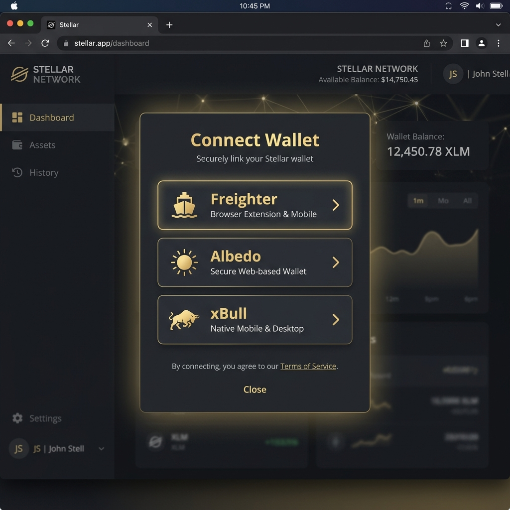

# ChronoBid

> "Live bidding, settled on-chain."

ChronoBid is a decentralized auction application built on the **Stellar network using Soroban smart contracts**. This project demonstrates a production-quality, enterprise-polished application for the Stellar "Yellow Belt" program.

## Overview

The application features a dark, cinematic aesthetic using a charcoal and warm gold color palette. It utilizes real-time polling to keep the UI perfectly synced with the on-chain Soroban smart contract, delivering a seamless web3 experience.

### Features
- **Smart Contract (Rust/Soroban):** Robust bidding logic, time-based auction expiration, refund mechanisms, and event emission.
- **Frontend (Next.js 14):** Real-time activity feed driven by on-chain events, cinematic UI with Framer Motion, and distinct error state handling.
- **Wallet Integration:** Built using `@creit.tech/stellar-wallets-kit`, supporting Freighter, xBull, and Albedo.
- **Live Event Sync:** Polls `getEvents` from the RPC to dynamically update the highest bid and live activity feed.

## Submission Details

- **Live Demo Link:** *Pending deployment* (Optional)
- **Screenshot of Wallet Options:**
  
- **Contract ID:** `CDETLPQATPAHV56B5XHLTHZVWX6BLRPG7RVBJJOX6LEW47FPLOAVUDPR`
- **Sample Transaction Hash (place_bid / init):** `edd9247250821a3223479d5c3976ff4ba2a2de22d9491bd13990edb33af80a52`
- **Explorer Link:** [Stellar Expert (Testnet)](https://stellar.expert/explorer/testnet/contract/CDETLPQATPAHV56B5XHLTHZVWX6BLRPG7RVBJJOX6LEW47FPLOAVUDPR)

## Setup & Local Development

### Prerequisites
- Node.js (v18+)
- Rust (latest stable) & `wasm32-unknown-unknown` target
- `stellar-cli`

### Smart Contract
1. Navigate to the contract directory: `cd contracts/auction`
2. Build the contract: `stellar contract build`
3. Run tests: `cargo test`

### Frontend
1. Navigate to the app directory: `cd app`
2. Install dependencies: `npm install`
3. Set up environment variables: Copy `.env.example` to `.env.local` and add the Contract ID.
4. Run the development server: `npm run dev`

## Architecture: Event Synchronization

ChronoBid uses an incremental state reconciliation pattern:
1. **Initial Mount:** The app calls `get_highest_bid` and `get_auction_state` to paint the initial UI.
2. **Polling Loop:** The app polls the Soroban RPC `getEvents` endpoint every 3 seconds, filtering for `new_bid` and `auction_ended` events specific to the deployed `Contract ID`.
3. **State Reconciliation:** As new events arrive, they are parsed and prepended to the live activity feed. The highest bid is updated implicitly without re-triggering heavy contract calls, ensuring a fluid UX without manual refresh.

## Known Limitations & Next Steps
- **Token Decimals:** The contract currently operates in stroops for simplicity, but a production app would format decimals based on the specific SAC token precision.
- **WebSocket Streaming:** The RPC currently requires polling `getEvents`. Future iterations could leverage streaming WebSockets if natively supported by the SDK/RPC.
- **Admin Dashboard:** Adding a specialized admin route to deploy new auctions or manage active ones.